### Браузерное окружение, спецификации

Язык JavaScript изначально был создан для веб-браузеров. Но с тех пор он значительно эволюционировал и превратился в кроссплатформенный язык программирования для решения широкого круга задач.

Сегодня JavaScript может использоваться в браузере, на веб-сервере или в какой-то другой среде, даже в кофеварке. Каждая среда предоставляет свою функциональность, которую спецификация JavaScript называет окружением.

Окружение предоставляет свои объекты и дополнительные функции, в дополнение базовым языковым. Браузеры, например, дают средства для управления веб-страницами. Node.js делает доступными какие-то серверные возможности и так далее.

На картинке ниже в общих чертах показано, что доступно для JavaScript в браузерном окружении:

Как мы видим, имеется корневой объект window, который выступает в 2 ролях:

- Во-первых, это глобальный объект для JavaScript-кода,
- Во-вторых, он также представляет собой окно браузера и располагает методами для управления им.

## DOM (Document Object Model)

Document Object Model, сокращённо DOM – объектная модель документа, которая представляет все содержимое страницы в виде объектов, которые можно менять.

Объект document – основная «входная точка». С его помощью мы можем что-то создавать или менять на странице.

Например:

Мы использовали в примере только document.body.style, но на самом деле возможности по управлению страницей намного шире. Различные свойства и методы описаны в спецификации:

DOM – не только для браузеров
Спецификация DOM описывает структуру документа и предоставляет объекты для манипуляций со страницей. Существуют и другие, отличные от браузеров, инструменты, использующие DOM.

Например, серверные скрипты, которые загружают и обрабатывают HTML-страницы, также могут использовать DOM. При этом они могут поддерживать спецификацию не полностью.

CSSOM для стилей
Правила стилей CSS структурированы иначе чем HTML. Для них есть отдельная спецификация CSSOM, которая объясняет, как стили должны представляться в виде объектов, как их читать и писать.

CSSOM используется вместе с DOM при изменении стилей документа. В реальности CSSOM требуется редко, обычно правила CSS статичны. Мы редко добавляем/удаляем стили из JavaScript, но и это возможно.

### BOM (Browser Object Model)

Объектная модель браузера (Browser Object Model, BOM) – это дополнительные объекты, предоставляемые браузером (окружением), чтобы работать со всем, кроме документа.

Например:

Объект navigator даёт информацию о самом браузере и операционной системе. Среди множества его свойств самыми известными являются: navigator.userAgent – информация о текущем браузере, и navigator.platform – информация о платформе (может помочь в понимании того, в какой ОС открыт браузер – Windows/Linux/Mac и так далее).
Объект location позволяет получить текущий URL и перенаправить браузер по новому адресу.
Вот как мы можем использовать объект location:

Функции alert/confirm/prompt тоже являются частью BOM: они не относятся непосредственно к странице, но представляют собой методы объекта окна браузера для коммуникации с пользователем.

Спецификации
BOM является частью общей спецификации HTML.

Да, вы всё верно услышали. Спецификация HTML по адресу https://html.spec.whatwg.org не только про «язык HTML» (теги, атрибуты), она также покрывает целое множество объектов, методов и специфичных для каждого браузера расширений DOM. Это всё «HTML в широком смысле». Для некоторых вещей есть отдельные спецификации, перечисленные на https://spec.whatwg.org.
sw

# JavaScript, синхронный, асинхронный, однопоточный?

### JavaScript — синхронный и однопоточный язык

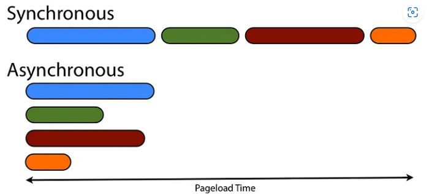

### Что означает однопоточный?

За раз обрабатывается по одной команде.

В стеке вызовов ваш JS-код считывается и выполняется построчно. Сейчас JavaScript является однопоточным языком, что означает, что он имеет только один стек вызовов, который используется для выполнения программы.

### Что значит «синхронный»?

В синхронном программировании шаги, определенные последовательно, выполняются в одном и том же порядке.

Простыми словами, синхронно означает, что код выполняется строка за строкой.

Так, например, приведенный ниже код будет выполняться в письменном порядке

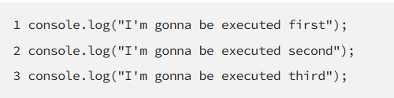

Таким образом, строка 3 должна ожидать выполнения строки 2, строка 2 должна ждать выполнения 1 и так далее. И если строка 2 выдаст ошибку, строка 3 никогда не будет выполнена

В этом примере ниже (пример 1) мы вызываем первую функцию sayHello(), поэтому она напечатает "Hello"
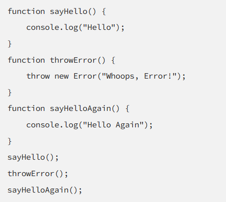

Затем движок JavaScript перейдет ко второму вызову функции, который в нашем случае throwError(), и так как это вызовет ошибку, JavaScript остановит выполнение, и "Hello Again" никогда не будет напечатан.

Вот результат из консоли

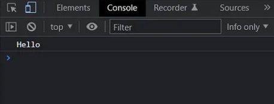

Проблема в том, что иногда функция, которая вызывается в середине нашего кода, требует много времени для выполнения, и если мы вызываем ее синхронно, окно нашего приложения будет заморожено до тех пор, пока эта функция не завершит выполнение, прежде чем движок JavaScript сможет запустить следующую строку кода. А здесь мы асинхронный вызов.
|

### Что означает асинхронный?

Асинхронное программирование — это метод, который позволяет программе запустить потенциально длительную задачу, а затем, вместо того, чтобы ждать, пока эта задача завершится, иметь возможность продолжать реагировать на другие события во время выполнения задачи.

Простыми словами, Если бы эта линия заняла много времени, Мы не можем дождаться этого

Оставьте его на потом, выполните остальное сейчас, а затем вернитесь и выполните его

Таким образом, вместо того, чтобы ждать, пока ваш друг, который всегда опаздывает, будет готов, вы можете забрать остальную часть банды на своей машине, а затем оставить этого друга напоследок, таким образом, вы не будете ждать и тратить время впустую. Здесь вас ждет асинхронное путешествие!

Но JavaScript — это синхронный язык, поэтому будет ли окно браузера зависать всякий раз, когда у нас есть долгая задача, которую нужно выполнить?

## Колбек функции

Функция колбек - это предоставляемая вами функция, которая будет выполняться после завершения асинхронной операции.

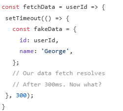
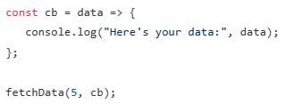

Определение функции fetchData: Эта функция принимает два параметра: userId (идентификатор пользователя) и callback (функцию обратного вызова). Она имитирует процесс асинхронной загрузки данных пользователя на основе его userId.

Использование setTimeout: Внутри функции fetchData используется setTimeout, чтобы имитировать асинхронную задержку на 300 миллисекунд. Это имитирует время, необходимое для выполнения асинхронной операции, такой как запрос к серверу для получения данных.

Создание фиктивных данных: После истечения задержки создается объект fakeData, содержащий id и name пользователя. Эти данные являются фиктивными и используются здесь для имитации результата, который мог бы быть получен от реального запроса к серверу.
щшг шгне2
Вызов функции обратного вызова: С помощью параметра callback, функция fetchData затем передает фиктивные данные (fakeData) в функцию обратного вызова. Это позволяет обработать полученные данные вне функции fetchData.

Определение функции обратного вызова cb: Функция cb определяется как функция обратного вызова, которая просто выводит полученные данные в консоль. Эта функция будет вызвана с фиктивными данными после задержки.

Вызов fetchData с функцией обратного вызова cb: Наконец, функция fetchData вызывается с userId (в этом случае 5) и функцией обратного вызова cb. После задержки в 300 мс функция cb вызывается с фиктивными данными, и в консоль выводится сообщение "Here's your data: {id: 5, name: "George"}".

### JavaScript. Promise

В JavaScript Promise представляет собой объект, который используется для асинхронных операций. Он может находиться в одном из трех состояний:

Ожидание (pending): начальное состояние, не выполнено и не отклонено.
Выполнено (fulfilled): операция завершена успешно.
Отклонено (rejected): операция завершена с ошибкой.
Создание промиса происходит с помощью конструктора Promise, которому передается функция исполнитель (executor). Эта функция исполнитель принимает два аргумента: функции resolve и reject. Вызов resolve переводит промис в состояние "выполнено", а вызов reject — в состояние "отклонено".

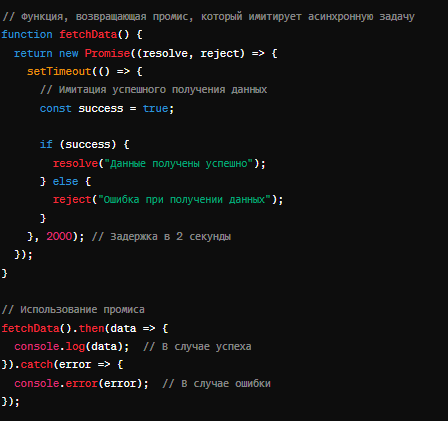

В этом примере функция fetchData возвращает промис, который через 2 секунды либо успешно завершается (вызывается resolve), либо завершается с ошибкой (вызывается reject). Мы используем методы .then и .catch для обработки результата промиса: .then срабатывает, если промис был выполнен успешно, и .catch — если произошла ошибка.

async и await — это синтаксический сахар в JavaScript, предназначенный для упрощения работы с промисами, делая асинхронный код более похожим на обычный синхронный код. Они были добавлены в ECMAScript 2017 (ES8) и представляют собой альтернативный способ работы с асинхронными операциями, такими как запросы к серверу с использованием fetch.

Основы async и await
async функция: При добавлении ключевого слова async перед функцией она автоматически возвращает промис. Если функция возвращает значение, не являющееся промисом, это значение будет обернуто в промис автоматически.

await оператор: Используется для ожидания разрешения промиса. await можно использовать только внутри async функции и останавливает выполнение функции до тех пор, пока промис не будет выполнен (resolved) или отклонен (rejected). После завершения промиса выполнение функции продолжается с возвращенным результатом.

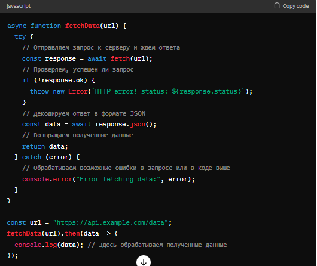

В этом примере функция fetchData асинхронно запрашивает данные с сервера по указанному URL. С помощью await она ожидает завершения HTTP-запроса, отправленного с помощью fetch, и декодирования ответа в формат JSON. Весь процесс выполнения функции приостанавливается на время выполнения асинхронных операций (fetch и .json()), что делает код более читаемым и понятным, по сравнению с использованием цепочек промисов и метода .then().

В блоке try...catch обрабатываются возможные ошибки, возникающие во время выполнения запроса или при обработке полученных данных. Это обеспечивает надежность и устойчивость вашего асинхронного кода к исключительным ситуациям.

# Событийный цикл: микрозадачи и макрозадачи

Поток выполнения в браузере, равно как и в Node.js, основан на событийном цикле.

Понимание работы событийного цикла важно для оптимизаций, иногда для правильной архитектуры.

В этой главе мы сначала разберём теорию, а затем рассмотрим её практическое применение.

### Событийный цикл

Идея событийного цикла очень проста. Есть бесконечный цикл, в котором движок JavaScript ожидает задачи, исполняет их и снова ожидает появления новых.

Общий алгоритм движка:

Пока есть задачи:
выполнить их, начиная с самой старой
Бездействовать до появления новой задачи, а затем перейти к пункту 1
Это формализация того, что мы наблюдаем, просматривая веб-страницу. Движок JavaScript большую часть времени ничего не делает и работает, только если требуется исполнить скрипт/обработчик или обработать событие.

Примеры задач:

Когда загружается внешний скрипт , то задача – это выполнение этого скрипта.
Когда пользователь двигает мышь, задача – сгенерировать событие mousemove и выполнить его обработчики.
Когда истечёт таймер, установленный с помощью setTimeout(func, ...), задача – это выполнение функции func
И так далее.
Задачи поступают на выполнение – движок выполняет их – затем ожидает новые задачи (во время ожидания практически не нагружая процессор компьютера)

Может так случиться, что задача поступает, когда движок занят чем-то другим, тогда она ставится в очередь.

Очередь, которую формируют такие задачи, называют «очередью макрозадач» (macrotask queue, термин v8)

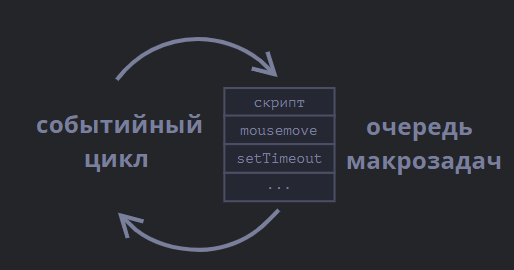

Например, когда движок занят выполнением скрипта, пользователь может передвинуть мышь, тем самым вызвав появление события mousemove, или может истечь таймер, установленный setTimeout, и т.п. Эти задачи формируют очередь, как показано на иллюстрации выше.

Задачи из очереди исполняются по правилу «первым пришёл – первым ушёл». Когда браузер заканчивает выполнение скрипта, он обрабатывает событие mousemove, затем выполняет обработчик, заданный setTimeout, и так далее.

Пока что всё просто, не правда ли?

Отметим две детали:

Рендеринг (отрисовка страницы) никогда не происходит во время выполнения задачи движком. Не имеет значения, сколь долго выполняется задача. Изменения в DOM отрисовываются только после того, как задача выполнена.
Если задача выполняется очень долго, то браузер не может выполнять другие задачи, обрабатывать пользовательские события, поэтому спустя некоторое время браузер предлагает «убить» долго выполняющуюся задачу. Такое возможно, когда в скрипте много сложных вычислений или ошибка, ведущая к бесконечному циклу.
Это была теория. Теперь давайте взглянем, как можно применить эти знания.

Пример 1: разбиение «тяжёлой» задачи.
Допустим, у нас есть задача, требующая значительных ресурсов процессора.

Например, подсветка синтаксиса (используется для выделения цветом участков кода на этой странице) – довольно процессороёмкая задача. Для подсветки кода надо выполнить синтаксический анализ, создать много элементов для цветового выделения, добавить их в документ – для большого текста это требует значительных ресурсов.

Пока движок занят подсветкой синтаксиса, он не может делать ничего, связанного с DOM, не может обрабатывать пользовательские события и т.д. Возможно даже «подвисание» браузера, что совершенно неприемлемо.

Мы можем избежать этого, разбив задачу на части. Сделать подсветку для первых 100 строк, затем запланировать setTimeout (с нулевой задержкой) для разметки следующих 100 строк и т.д.

Чтобы продемонстрировать такой подход, давайте будем использовать для простоты функцию, которая считает от 1 до 1000000000.

Если вы запустите код ниже, движок «зависнет» на некоторое время. Для серверного JS это будет явно заметно, а если вы будете выполнять этот код в браузере, то попробуйте понажимать другие кнопки на странице – вы заметите, что никакие другие события не обрабатываются до завершения функции счёта.

# Axios

Axios — это обещание (promise)-основанная HTTP клиентская библиотека для браузера и node.js. Она предоставляет простой API для выполнения запросов HTTP и обработки ответов. Axios широко используется для обращения к REST API из JavaScript-приложений, включая фронтенд на React, Vue, Angular и серверные приложения на Node.js.

Основные характеристики Axios:
Из коробки поддерживает промисы.
Легко отправлять асинхронные HTTP-запросы к REST-эндпоинтам и обрабатывать ответы.
Поддерживает защиту от XSRF.
Позволяет выполнять запросы и получать ответы в JSON-формате.
Поддерживает перехват запросов и ответов, что позволяет легко реализовать, например, обработку ошибок или логирование на глобальном уровне.
Конфигурационные параметры для запросов могут быть установлены глобально, что облегчает настройку клиента для всего приложения.
Пример использования Axios:
Установка через npm:

### TypeScript

TypeScript — это язык программирования, разработанный и поддерживаемый Microsoft. Он является строго типизированным суперсетом JavaScript, что означает, что любой валидный JavaScript-код также является валидным TypeScript-кодом. TypeScript добавляет дополнительные функции к JavaScript, включая статическую типизацию и объектно-ориентированные элементы, такие как интерфейсы и абстрактные классы, что делает его особенно подходящим для разработки крупномасштабных приложений.

Основные особенности TypeScript:
Статическая типизация: TypeScript позволяет явно указывать типы переменных, функций и объектов, что облегчает отладку и предотвращает многие типы ошибок на этапе компиляции.
Поддержка ECMAScript стандартов: TypeScript поддерживает новейшие стандарты ECMAScript и даже предлагает некоторые возможности, которые еще не включены в стандарт JavaScript.
Инструменты разработки: Благодаря статической типизации TypeScript улучшает функционал сред разработки, таких как автодополнение кода, переход к определениям и автоматический рефакторинг.
Компиляция в JavaScript: TypeScript компилируется в чистый JavaScript, что означает, что вы можете использовать его для разработки приложений, которые будут работать в любом браузере, на любом хосте и в любой операционной системе.
Модульность: TypeScript поддерживает модули ES6, что упрощает организацию и повторное использование кода.

## Пример простого кода на TypeScript:

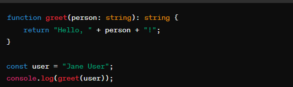

В этом примере функция greet явно принимает параметр типа string и возвращает строку. Это показывает, как TypeScript позволяет указывать типы для параметров и возвращаемых значений функций.

Как начать использовать TypeScript:
Установка: Сначала вам нужно установить TypeScript. Это можно сделать через npm (менеджер пакетов для JavaScript), выполнив команду npm install -g typescript в терминале.
Компиляция: После написания кода на TypeScript его можно скомпилировать в JavaScript, используя команду tsc, например tsc myscript.ts.
TypeScript продолжает набирать популярность среди разработчиков благодаря своей способности улучшать масштабируемость и поддерживаемость кода, особенно в больших и сложных проектах.

В TypeScript кортежи (tuples) — это способ определения массива с фиксированным количеством элементов, где каждый элемент может быть разного типа. Они очень полезны, когда вам нужно строго определить структуру массива, например, когда функция должна возвращать несколько значений разных типов.

Чтобы определить кортеж в TypeScript, вы используете квадратные скобки [], внутри которых перечисляете типы данных элементов кортежа:
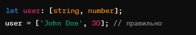

В этом примере user — это кортеж, состоящий из строки и числа. Первый элемент должен быть строкой, а второй — числом.

Ограничения и особенности кортежей
Вы не можете обратиться к элементу за пределами определённого диапазона индексов кортежа.
TypeScript поддерживает "optional" элементы в кортежах, что позволяет элементам быть необязательными.
TypeScript также поддерживает остаточные элементы в кортежах с помощью оператора распространения (...).