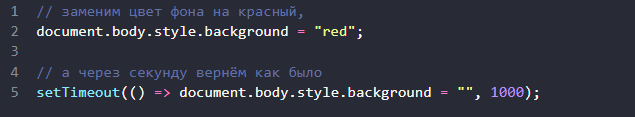

### Браузерное окружение, спецификации

Язык JavaScript изначально был создан для веб-браузеров. Но с тех пор он значительно эволюционировал и превратился в кроссплатформенный язык программирования для решения широкого круга задач.

Сегодня JavaScript может использоваться в браузере, на веб-сервере или в какой-то другой среде, даже в кофеварке. Каждая среда предоставляет свою функциональность, которую спецификация JavaScript называет окружением.

Окружение предоставляет свои объекты и дополнительные функции, в дополнение базовым языковым. Браузеры, например, дают средства для управления веб-страницами. Node.js делает доступными какие-то серверные возможности и так далее.

На картинке ниже в общих чертах показано, что доступно для JavaScript в браузерном окружении:

Как мы видим, имеется корневой объект window, который выступает в 2 ролях:

- Во-первых, это глобальный объект для JavaScript-кода,
- Во-вторых, он также представляет собой окно браузера и располагает методами для управления им.

## DOM (Document Object Model)

Document Object Model, сокращённо DOM – объектная модель документа, которая представляет все содержимое страницы в виде объектов, которые можно менять.

Объект document – основная «входная точка». С его помощью мы можем что-то создавать или менять на странице.

Например:

Мы использовали в примере только document.body.style, но на самом деле возможности по управлению страницей намного шире. Различные свойства и методы описаны в спецификации:

DOM – не только для браузеров
Спецификация DOM описывает структуру документа и предоставляет объекты для манипуляций со страницей. Существуют и другие, отличные от браузеров, инструменты, использующие DOM.

Например, серверные скрипты, которые загружают и обрабатывают HTML-страницы, также могут использовать DOM. При этом они могут поддерживать спецификацию не полностью.

CSSOM для стилей
Правила стилей CSS структурированы иначе чем HTML. Для них есть отдельная спецификация CSSOM, которая объясняет, как стили должны представляться в виде объектов, как их читать и писать.

CSSOM используется вместе с DOM при изменении стилей документа. В реальности CSSOM требуется редко, обычно правила CSS статичны. Мы редко добавляем/удаляем стили из JavaScript, но и это возможно.

### BOM (Browser Object Model)

Объектная модель браузера (Browser Object Model, BOM) – это дополнительные объекты, предоставляемые браузером (окружением), чтобы работать со всем, кроме документа.

Например:

Объект navigator даёт информацию о самом браузере и операционной системе. Среди множества его свойств самыми известными являются: navigator.userAgent – информация о текущем браузере, и navigator.platform – информация о платформе (может помочь в понимании того, в какой ОС открыт браузер – Windows/Linux/Mac и так далее).
Объект location позволяет получить текущий URL и перенаправить браузер по новому адресу.
Вот как мы можем использовать объект location:

Функции alert/confirm/prompt тоже являются частью BOM: они не относятся непосредственно к странице, но представляют собой методы объекта окна браузера для коммуникации с пользователем.

Спецификации
BOM является частью общей спецификации HTML.

Да, вы всё верно услышали. Спецификация HTML по адресу https://html.spec.whatwg.org не только про «язык HTML» (теги, атрибуты), она также покрывает целое множество объектов, методов и специфичных для каждого браузера расширений DOM. Это всё «HTML в широком смысле». Для некоторых вещей есть отдельные спецификации, перечисленные на https://spec.whatwg.org.
